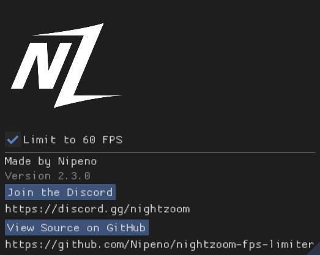

# NightZoom FPS Limiter

Locks your game to a smooth **60 FPS**. A simple add-on for [ReShade](https://reshade.me) with
one button - turn it on to cap, turn it off to unlock.

> Made by **Nipeno**

## Why 60?

GTA's physics is tied to your frame rate - cars handle differently at different FPS. Capping
everyone to the same 60 keeps racing fair, which is why the cap is a fixed 60 and not a slider.

## ⚠️ Please read first

Made for the **NightZoom** racing server, where it's allowed. On **other servers, use it at your
own risk** - every server sets its own rules, and some anticheats may flag add-ons that load into
the game. If you're unsure about a server, ask its staff first.

It needs the **add-on-enabled** build of ReShade - and the download includes it, so you're
covered even if you've never used ReShade. Graphics packs like NVE and QuantV already include
ReShade too.

## How to install

Download **`NZ-FPS-Limiter…zip`** from the
[**Releases page**](https://github.com/Nipeno/nightzoom-fps-limiter/releases/latest), extract it,
and open the included **`Install Guide.html`** - it walks you through the whole setup, including the
one-time FiveM "ReShade was blocked" fix. The zip bundles ReShade, so it's all you need.

## Is it safe? What does it do?

This add-on is **open source**, so anyone can read exactly what it does. It only:

- caps your frame rate to 60 FPS,
- remembers your on/off choice,
- shows the logo, Discord link, and a link to the code.

It has **no ads, no tracking, no internet connection** (the only time it opens your browser is
when *you* click the Discord or GitHub buttons), and it doesn't touch your game's files.

The full source code is right here in this repo, and there's a **View Source on GitHub** button
inside the add-on too.

## Troubleshooting

Already have ReShade from a graphics pack? **Just add the add-on and change nothing else.** It works
with any ReShade from **6.1 onwards**, so there's no need to replace what you have.

The **Troubleshooting** sections of the bundled `Install Guide.html` cover the rest - the overlay
not opening (try both **Home** and **Insert**; some setups remap the key), and what to do if you're
on a ReShade older than 6.1.

One that catches people out: **turn off VSync in-game.** The limiter and VSync both wait for
their own timing, and running them together can stack those waits into stutter or an effective
30 FPS. Use one or the other - this add-on instead of VSync.

## Support

Found a bug, or something won't install?
**[Open an issue](https://github.com/Nipeno/nightzoom-fps-limiter/issues/new/choose)** - bug
reports and questions are both handled on GitHub, so answers stay searchable for the next person
who hits the same thing.

Not on the NightZoom server yet? The Discord is at <https://discord.gg/nightzoom> - that's the
place to get onto the server, not the place to report add-on bugs.

## Credits

- Developer: **Nipeno**
- Testers: **Beanz**, **Cenkov**, **PhatWraith**, **krispy lzz**, **Wraith**, **hachiro**

## For developers

Want to build it yourself or see how it works? See **[BUILDING.md](BUILDING.md)**.
Contributions welcome - start with **[CONTRIBUTING.md](CONTRIBUTING.md)**.

## License

Free and open source under **GPLv3** - see [LICENSE](LICENSE). You can use, study, and modify it,
but any shared version must stay open source too.
